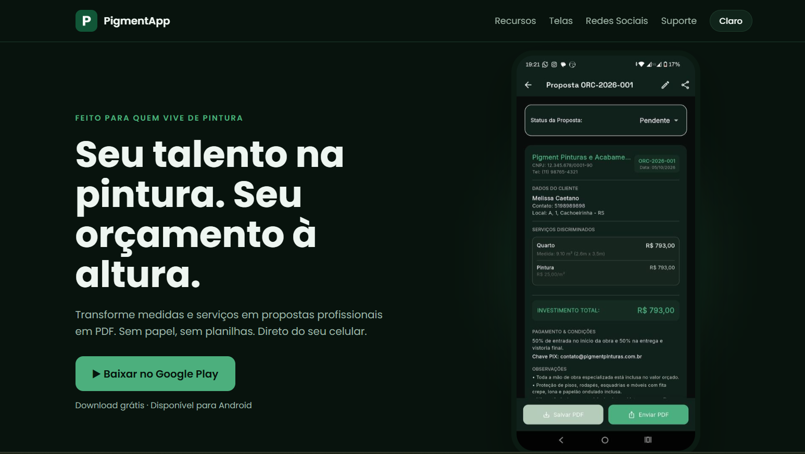

# PigmentApp — Landing Page

Landing page oficial do **PigmentApp**, aplicativo Android para pintores criarem orçamentos profissionais em PDF direto do celular.

🔗 **Site:** https://pigmentapp-prod.web.app

📱 **App:** [Google Play](https://play.google.com/store/apps/details?id=com.juniorpfo.pigmentapp)

  

## Sobre

O PigmentApp transforma medidas e serviços em propostas em PDF, com a logo e os dados da empresa do pintor, e permite enviar pelo WhatsApp. Esta página apresenta o app e reúne os canais institucionais exigidos pela Google Play (termos, privacidade e exclusão de conta).

## Páginas

| Página | Arquivo |
|---|---|
| Início | `index.html` |
| Termos de Uso | `termos.html` |
| Política de Privacidade | `privacidade.html` |
| Exclusão de Conta | `exclusao-de-conta.html` |
| Suporte (formulário) | `suporte.html` |

## Recursos

- Layout responsivo, pensado primeiro para celular
- Tema escuro e claro, com botão de alternância
- Galeria de telas do app com troca automática
- Animações de entrada ao rolar a página
- Formulário de suporte com envio por e-mail, sem servidor próprio
- Seção "Desenvolvido por" com links de redes sociais

## Tecnologias

HTML, CSS e JavaScript puros, sem frameworks nem etapa de build. Fonte Poppins via Google Fonts. Hospedagem no **Firebase Hosting**.

## Estrutura

```
.
├── index.html
├── termos.html
├── privacidade.html
├── exclusao-de-conta.html
├── suporte.html
├── css/
│   ├── style.css      # visual da página inicial e variáveis de cor (:root)
│   └── legal.css      # páginas de texto e suporte
├── js/
│   ├── main.js        # galeria de telas, tema e animações
│   └── legal.js       # tema e formulário de suporte
├── assets/            # imagens e ícone
├── firebase.json
└── .firebaserc
```

## Como editar

- **Textos e links:** nos arquivos `.html`.
- **Cores:** variáveis no topo do `css/style.css` (`:root` para o tema claro e `:root[data-t=dark]` para o escuro).
- **Telas da galeria:** lista `S` no início do `js/main.js`.
- **E-mail do suporte:** constante `EMAIL` no início do `js/legal.js`.
- **Imagens:** substitua os arquivos em `assets/` mantendo o mesmo nome.

## Rodar localmente

Não precisa instalar nada. Abra o `index.html` no navegador, ou, para simular o servidor:

```bash
npx serve .
```

## Deploy

Pré-requisito: [Firebase CLI](https://firebase.google.com/docs/cli) instalada e login feito.

```bash
npm install -g firebase-tools
firebase login

# prévia temporária
firebase hosting:channel:deploy teste

# produção
firebase deploy --only hosting
```

O `firebase.json` publica a própria pasta do projeto (`"public": "."`) e ignora arquivos internos como `.git` e `.firebase`.

## Formulário de suporte

O envio usa o [FormSubmit](https://formsubmit.co). No primeiro envio, o serviço manda um e-mail de confirmação para o endereço configurado, e só depois de ativado as mensagens passam a chegar.

## Autor

**Paulo Fernando de Oliveira Júnior**

[GitHub](https://github.com/PauloFOJr) · [LinkedIn](https://www.linkedin.com/in/SEU_USUARIO) · [Instagram](https://www.instagram.com/SEU_USUARIO)

---

© 2026 PigmentApp. Feito para quem vive de pintura.
